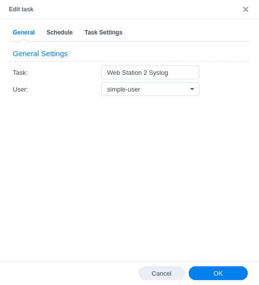
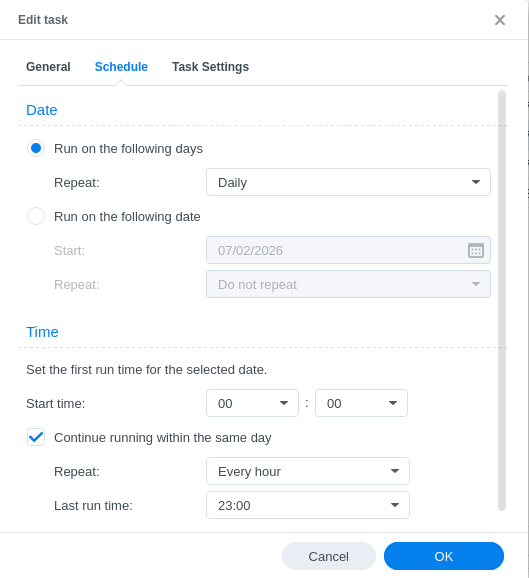
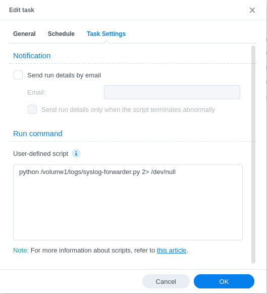

# Forward Synology Log Center

## Description

**What ?** This script aims to forward Synology Log Center events and log databases to a Syslog server.

**Why ?** Because Synology can't receive AND forward received logs to a syslog server. It can only send local logs.  
Because Synology Web Station does not integrate access logs (apache & nginx) to Log Center.

**For wich use case ?** 

1. If you want the Log Center to act as your main Syslog server to use the integrated features of Synology environment, and in the meantime, use a secondary application like Wazuh or EventLog Analyzer, you can just run this Python script to forward the Log Center logs to your Wazuh server for exemple ;

2. If you want to add Web Station access logs to Log Center, you can read the logs with this script and forward it to localhost wich will be added to you Log Center.

**How ?** This script is pure Python only to be working with Python 3.8 integrated in DSM, no requirement, pip package or anything.  
It is recommended to use it with a scheduled task, run every hour with a low privilege user (read + write permissions to log location, see beelow). 

## Setup

You need to modify the server destination by changing SYSLOG_SERVER address or fqdn here :
```python
# Add syslog configuration
syslogHandler = handlers.SysLogHandler(address=("SYSLOG_SERVER", 514))
```

This script will search for logs in a specific shared folder here `/volume1/logs`. If you have a different location, modify those lines below. For exemple, in use case n°2, you can only keep the Web Station line and remove the two other ones. 
```python
# Log locations
log_dirs = [
    "/volume1/@appdata/WebStation/log/*",
    "/volume1/logs/*",
    "/volume1/logs/*/*",
]
```

By default, the script will also search for access logs (apache & nginx) that are not integrated into Log Center. You can add your own regex paths if you know other log databases locations.  

Now let's say you upoad the script here : `/volume1/logs/syslog-forwarder.py`. Create a scheduled task (in DSM control panel) as followed :

1. General informations :



2. Scheduler :



3. Settings :



You can test if the task run smoothly by checking the output. It needs to be print "Successfuly read Log Center !".

## Todo

- [ ] Parameters

It would be easier to turn this script into a program with command line arguments, like :
```sh
python /volume1/logs/syslog-forwarder.py --server syslog.local --port 514 --proto udp --main-location "/volume1/logs" --webstation-location "/volume1/@appdata/WebStation/log/"
```
